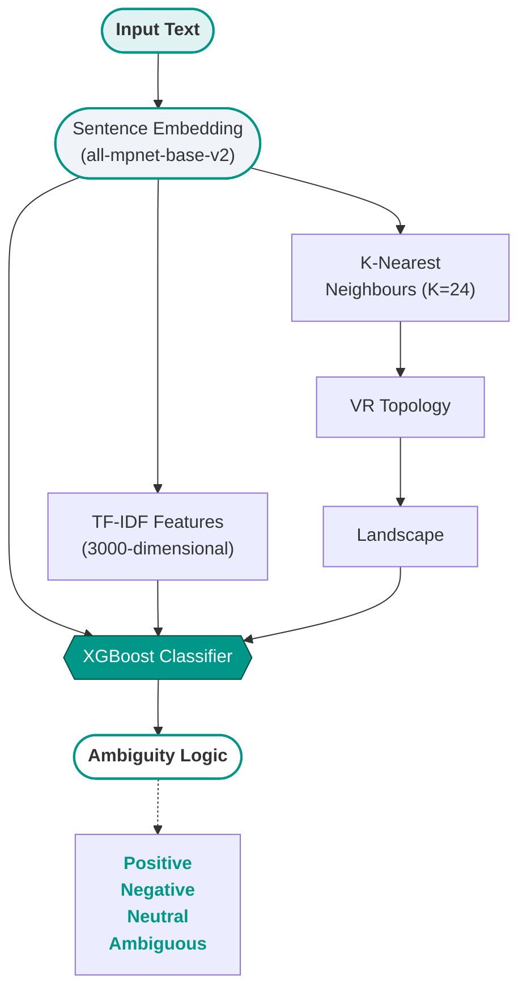

# Emotion Detection System Architecture

This diagram represents the topological data analysis (TDA) and machine learning pipeline for emotion classification.

```mermaid
graph TD
    %% Nodes
    Input(["<b>Input Text</b>"])
    Embed(["Sentence Embedding<br/>(all-mpnet-base-v2)"])
    
    TFIDF["TF-IDF Features<br/>(3000-dimensional)"]
    KNN["K-Nearest<br/>Neighbours (K=24)"]
    
    VR["VR Topology"]
    Land["Landscape"]
    
    Model{{"XGBoost Classifier"}}
    Logic(["<b>Ambiguity Logic</b>"])
    
    Output["Positive<br/>Negative<br/>Neutral<br/>Ambiguous"]

    %% Connections
    Input --> Embed
    Embed --> TFIDF
    Embed --> KNN
    Embed --> Model
    
    TFIDF --> Model
    KNN --> VR
    VR --> Land
    Land --> Model
    
    Model --> Logic
    Logic -.-> Output

    %% Styling
    style Input fill:#e0f2f1,stroke:#009688,stroke-width:2px
    style Embed fill:#f0f4f8,stroke:#009688,stroke-width:2px
    style Model fill:#009688,stroke:#004d40,color:#fff
    style Logic fill:#fff,stroke:#009688,stroke-width:2px
    style Output font-weight:bold,color:#009688
```
